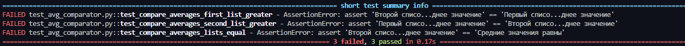
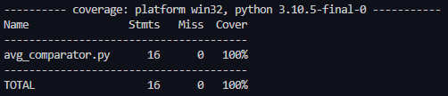

# Промежуточная аттестация
## Задание 1. Создайте программу на Python или Java, которая принимает два списка чисел и выполняет следующие действия:

a. Рассчитывает среднее значение каждого списка.

b. Сравнивает эти средние значения и выводит соответствующее сообщение:
- ""Первый список имеет большее среднее значение"", если среднее значение первого списка больше.
- ""Второй список имеет большее среднее значение"", если среднее значение второго списка больше.
- ""Средние значения равны"", если средние значения списков равны.
---
**Отчет о выполнении этого задания должен включать в себя следующие элементы:**

- Код программы
- Код тестов
- Отчет pylint/Checkstyle
- Отчет о покрытии тестами
- Объяснение того, какие сценарии покрыты тестами и почему вы выбрали именно эти сценарии.
---
## Отчеты 

- [Код программы](https://github.com/externalcharm/Unit-tests/blob/main/seminar6/avg_comparator.py)
- [Код тестов](https://github.com/externalcharm/Unit-tests/blob/main/seminar6/test_avg_comparator.py)
- Отчет pylint

- Отчет о покрытии тестами

- В тестах были рассмотрены различные сценарии, чтобы удостовериться, что программа работает правильно в различных ситуациях:

1. **test_compare_averages_first_list_greater:** Проверяет случай, когда среднее значение первого списка больше среднего значения второго списка.

2. **test_compare_averages_second_list_greater:** Проверяет случай, когда среднее значение второго списка больше среднего значения первого списка.

3. **test_compare_averages_lists_equal:** Проверяет случай, когда средние значения списков равны.

4. **test_compare_averages_empty_lists:** Проверяет случай, когда оба списка пусты. Важно убедиться, что программа корректно обрабатывает эту ситуацию.

5. **test_compare_averages_first_list_empty:** Проверяет случай, когда первый список пустой. Это важный сценарий для обработки.

6. **test_compare_averages_second_list_empty:** Проверяет случай, когда второй список пустой. Это также важный сценарий для обработки.

*Выбор этих сценариев обеспечивает полное покрытие основных вариантов использования и граничных условий. Проверка случаев с пустыми списками важна, чтобы избежать ошибок при работе с пустыми входными данными. Тестирование ситуаций, когда один из списков пуст, также важно для проверки корректной обработки различных комбинаций входных данных.*

---
